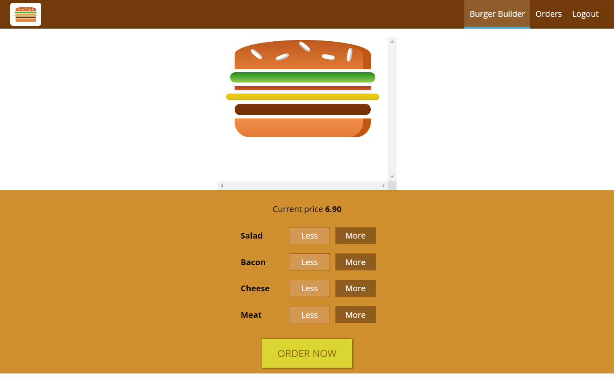

# FastBurger

## About 

A responsive, single-page, React.js web application that allows creating and ordering a custom burger while the user is authenticated, and viewing the existing orders of authenticated users. It contains a validation form where the user enters personal information to receive the order. 

- Home page

- Authentication, Signup/Signin to order

- Customize your burger, add/remove ingredients, press the ORDER button

- Fill the form fields and press ORDER, again

- Check your account orders

## Deployment

Firebase hosting: https://burger-app-5e595.firebaseapp.com

## Technologies & Tools

- React.js
- CSS3
- Firebase 
- Ajax
- Visual Studio Code 

## Includes

- Redux
- Routing
- Authentication
- Form validation
- Basic Sagas
- Webpack 4

## Authors

Based on Maximilian Schwarzmüller's Udemy course https://www.udemy.com/react-the-complete-guide-incl-redux

